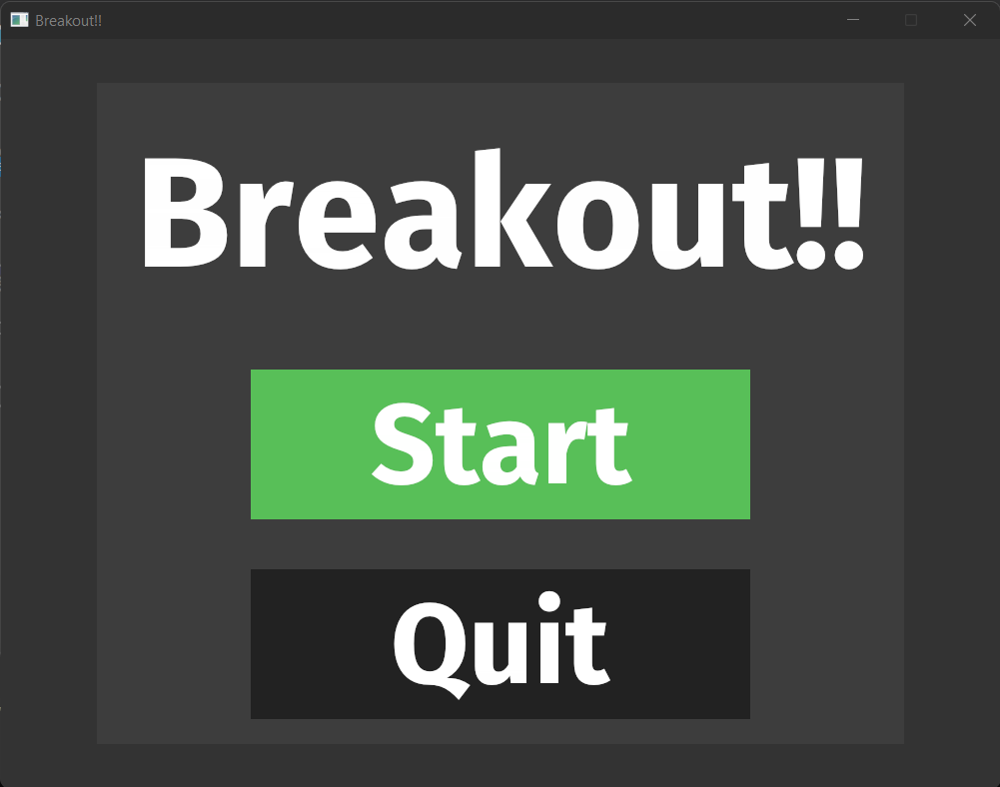
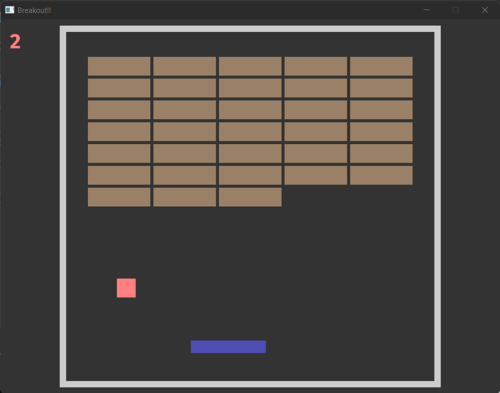
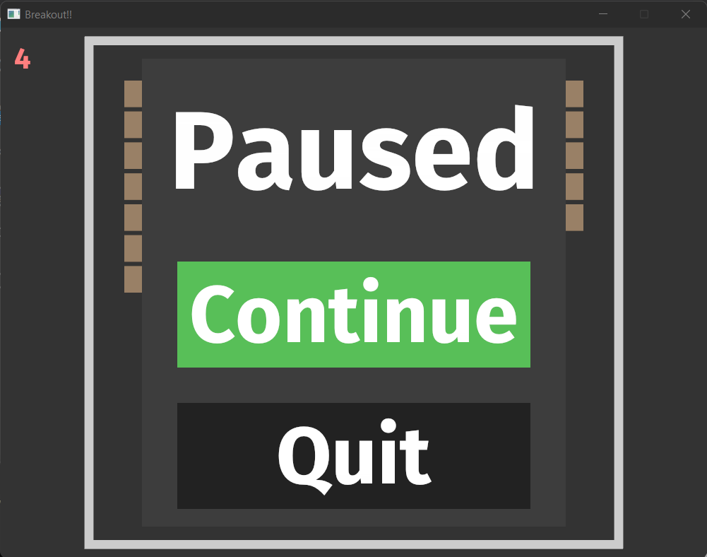
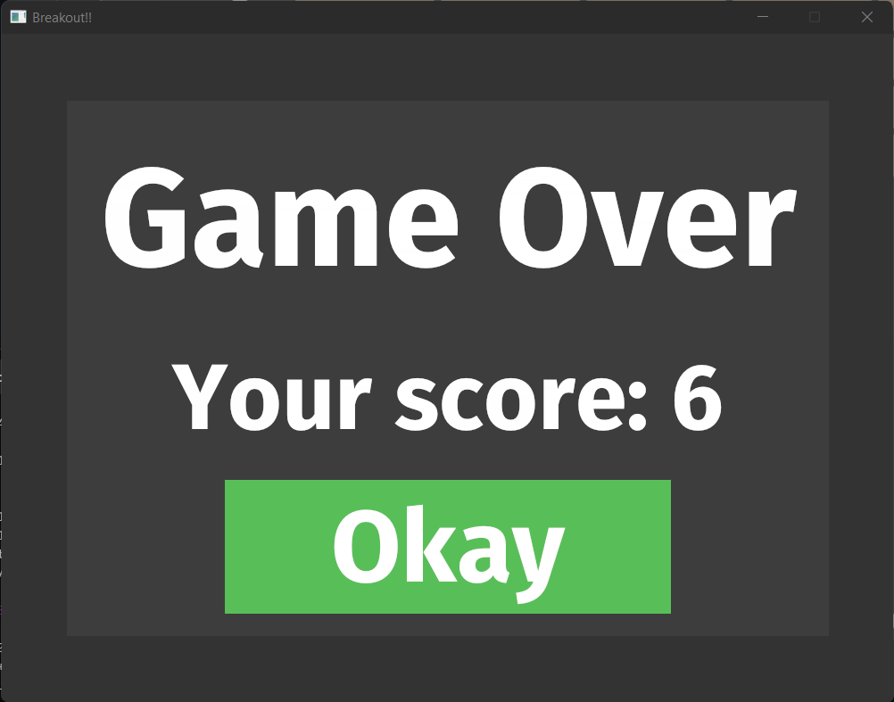

## Breakout in Bevy Rust
Learning Rust/Bevy by making the game breakout.

Learning points:
- State management
  - Menu, Game, Pause states
  - Changing of states
- Menu interaction
- Collision detection

## Different states
### Menu

### In Game

### Paused

### Game Over

